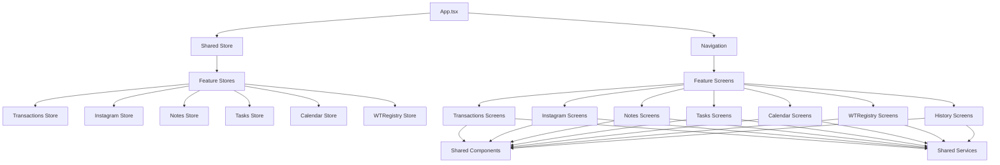

# Feature-First Architecture Migration - Design Document

## Overview

This document outlines the technical design for migrating the AllInOne React Native application from a feature-type organization to a feature-first architecture. The migration will improve code organization, maintainability, and scalability while preserving all existing functionality.

## Architecture

### Current Structure Analysis

```
src/
├── components/          # Mixed shared and feature-specific components
├── screens/            # Feature-organized screens
│   ├── transactions/
│   ├── instagram/
│   ├── notes/
│   ├── tasks/
│   ├── calendar/
│   ├── history/
│   └── wtregistry/
├── services/           # Mixed shared and feature-specific services
├── store/              # All Redux slices
├── types/              # All TypeScript types
├── utils/              # All utility functions
├── config/             # Configuration files
└── theme/              # Theme configuration
```

### Target Structure Design

```
src/
├── features/
│   ├── transactions/
│   │   ├── components/
│   │   │   ├── TransactionCard.tsx
│   │   │   ├── TransactionForm.tsx
│   │   │   └── index.ts
│   │   ├── screens/
│   │   │   ├── TransactionHomeScreen.tsx
│   │   │   ├── InvestmentsTab.tsx
│   │   │   ├── ReportsTab.tsx
│   │   │   └── index.ts
│   │   ├── services/
│   │   │   ├── transactionApi.ts
│   │   │   └── index.ts
│   │   ├── store/
│   │   │   ├── transactionSlice.ts
│   │   │   ├── balanceSlice.ts
│   │   │   └── index.ts
│   │   ├── types/
│   │   │   ├── Transaction.ts
│   │   │   ├── Balance.ts
│   │   │   └── index.ts
│   │   ├── utils/
│   │   │   ├── transactionHelpers.ts
│   │   │   └── index.ts
│   │   └── index.ts
│   ├── instagram/
│   │   ├── components/
│   │   │   ├── InstagramHeader.tsx
│   │   │   ├── PostCard.tsx
│   │   │   └── index.ts
│   │   ├── screens/
│   │   │   ├── InstagramScreen.tsx
│   │   │   ├── PostsTab.tsx
│   │   │   ├── InsightsTab.tsx
│   │   │   ├── AskAITab.tsx
│   │   │   └── index.ts
│   │   ├── services/
│   │   │   ├── InstagramApiService.ts
│   │   │   └── index.ts
│   │   ├── store/
│   │   │   ├── instagramSlice.ts
│   │   │   └── index.ts
│   │   ├── types/
│   │   │   ├── Instagram.ts
│   │   │   └── index.ts
│   │   ├── utils/
│   │   │   ├── instagramHelpers.ts
│   │   │   └── index.ts
│   │   └── index.ts
│   ├── wtregistry/
│   │   ├── screens/
│   │   │   ├── WTRegistryScreen.tsx
│   │   │   └── index.ts
│   │   ├── store/
│   │   │   ├── wtRegistrySlice.ts
│   │   │   └── index.ts
│   │   └── index.ts
│   ├── calendar/
│   │   ├── screens/
│   │   │   ├── CalendarScreen.tsx
│   │   │   └── index.ts
│   │   ├── store/
│   │   │   ├── calendarSlice.ts
│   │   │   └── index.ts
│   │   └── index.ts
│   ├── notes/
│   │   ├── screens/
│   │   │   ├── NotesScreen.tsx
│   │   │   ├── EditNoteScreen.tsx
│   │   │   └── index.ts
│   │   ├── store/
│   │   │   ├── notesSlice.ts
│   │   │   └── index.ts
│   │   └── index.ts
│   ├── tasks/
│   │   ├── screens/
│   │   │   ├── TasksScreen.tsx
│   │   │   └── index.ts
│   │   ├── store/
│   │   │   ├── tasksSlice.ts
│   │   │   └── index.ts
│   │   └── index.ts
│   └── history/
│       ├── screens/
│       │   ├── HistoryScreen.tsx
│       │   └── index.ts
│       └── index.ts
├── shared/
│   ├── components/
│   │   ├── forms/
│   │   │   ├── FormInput.tsx
│   │   │   ├── FormButton.tsx
│   │   │   └── index.ts
│   │   ├── navigation/
│   │   │   ├── DrawerContent.tsx
│   │   │   └── index.ts
│   │   ├── layout/
│   │   │   ├── Screen.tsx
│   │   │   ├── Container.tsx
│   │   │   └── index.ts
│   │   ├── ui/
│   │   │   ├── LoadingSpinner.tsx
│   │   │   ├── ErrorBoundary.tsx
│   │   │   └── index.ts
│   │   └── index.ts
│   ├── services/
│   │   ├── api/
│   │   │   ├── baseApi.ts
│   │   │   ├── httpClient.ts
│   │   │   └── index.ts
│   │   ├── firebase/
│   │   │   ├── firestore.ts
│   │   │   ├── auth.ts
│   │   │   └── index.ts
│   │   ├── storage/
│   │   │   ├── asyncStorage.ts
│   │   │   └── index.ts
│   │   └── index.ts
│   ├── store/
│   │   ├── index.ts
│   │   ├── rootReducer.ts
│   │   └── middleware.ts
│   ├── types/
│   │   ├── api.ts
│   │   ├── navigation.ts
│   │   ├── theme.ts
│   │   └── index.ts
│   ├── utils/
│   │   ├── formatting.ts
│   │   ├── validation.ts
│   │   ├── constants.ts
│   │   └── index.ts
│   ├── hooks/
│   │   ├── useAsyncStorage.ts
│   │   ├── useDebounce.ts
│   │   └── index.ts
│   └── index.ts
├── config/
│   ├── firebase.ts
│   └── index.ts
└── theme/
    ├── index.ts
    ├── lightTheme.ts
    └── darkTheme.ts
```

## Components and Interfaces

### Feature Module Structure

Each feature module follows a consistent structure:

```typescript
// features/[feature]/index.ts - Feature barrel export
export * from './screens';
export * from './components';
export * from './store';
export * from './types';
export * from './services';
export * from './utils';

// features/[feature]/screens/index.ts - Screen barrel export
export { default as FeatureScreen } from './FeatureScreen';

// features/[feature]/store/index.ts - Store barrel export
export { default as featureSlice } from './featureSlice';
export * from './featureSlice';

// features/[feature]/types/index.ts - Types barrel export
export * from './FeatureTypes';
```

### Shared Module Structure

```typescript
// shared/index.ts - Main shared barrel export
export * from './components';
export * from './services';
export * from './store';
export * from './types';
export * from './utils';
export * from './hooks';

// shared/components/index.ts - Components barrel export
export * from './forms';
export * from './navigation';
export * from './layout';
export * from './ui';
```

### Path Alias Configuration

```typescript
// tsconfig.json paths configuration
{
  "compilerOptions": {
    "paths": {
      // Feature aliases
      "@features/*": ["src/features/*"],
      "@features/transactions/*": ["src/features/transactions/*"],
      "@features/instagram/*": ["src/features/instagram/*"],
      "@features/wtregistry/*": ["src/features/wtregistry/*"],
      "@features/calendar/*": ["src/features/calendar/*"],
      "@features/notes/*": ["src/features/notes/*"],
      "@features/tasks/*": ["src/features/tasks/*"],
      "@features/history/*": ["src/features/history/*"],
      
      // Shared aliases
      "@shared/*": ["src/shared/*"],
      "@shared/components/*": ["src/shared/components/*"],
      "@shared/services/*": ["src/shared/services/*"],
      "@shared/store/*": ["src/shared/store/*"],
      "@shared/types/*": ["src/shared/types/*"],
      "@shared/utils/*": ["src/shared/utils/*"],
      "@shared/hooks/*": ["src/shared/hooks/*"],
      
      // Legacy aliases (for backward compatibility during migration)
      "@/*": ["src/*"],
      "@components/*": ["src/shared/components/*"],
      "@screens/*": ["src/features/*"],
      "@types/*": ["src/shared/types/*"],
      "@store/*": ["src/shared/store/*"],
      "@utils/*": ["src/shared/utils/*"],
      "@config/*": ["src/config/*"]
    }
  }
}
```

## Data Models

### Feature Dependency Graph



### Import Dependency Rules

1. **Features can import from:**
   - Their own modules
   - Shared modules
   - Config modules
   - Theme modules

2. **Features cannot import from:**
   - Other feature modules (direct imports)
   - Legacy structure paths

3. **Shared modules can import from:**
   - Other shared modules
   - Config modules
   - Theme modules
   - External libraries

4. **Shared modules cannot import from:**
   - Feature modules

## Error Handling

### Migration Error Prevention

1. **Broken Import Detection**
   ```typescript
   // Pre-migration validation script
   const validateImports = async () => {
     const files = await getAllTSFiles();
     const brokenImports = [];
     
     for (const file of files) {
       const imports = extractImports(file);
       for (const importPath of imports) {
         if (!await pathExists(resolveImportPath(importPath))) {
           brokenImports.push({ file, importPath });
         }
       }
     }
     
     return brokenImports;
   };
   ```

2. **Circular Dependency Detection**
   ```typescript
   // Detect circular dependencies between features
   const detectCircularDeps = (dependencyGraph: DependencyGraph) => {
     const visited = new Set();
     const recursionStack = new Set();
     
     const hasCycle = (node: string): boolean => {
       visited.add(node);
       recursionStack.add(node);
       
       for (const neighbor of dependencyGraph[node] || []) {
         if (!visited.has(neighbor) && hasCycle(neighbor)) {
           return true;
         } else if (recursionStack.has(neighbor)) {
           return true;
         }
       }
       
       recursionStack.delete(node);
       return false;
     };
     
     return Object.keys(dependencyGraph).some(hasCycle);
   };
   ```

3. **Build Validation**
   ```typescript
   // Ensure TypeScript compilation succeeds
   const validateBuild = async () => {
     try {
       await exec('npx tsc --noEmit');
       return { success: true };
     } catch (error) {
       return { success: false, errors: error.stdout };
     }
   };
   ```

## Testing Strategy

### Migration Testing Approach

1. **Pre-Migration Snapshot**
   - Create comprehensive test suite covering all current functionality
   - Document all current import paths and dependencies
   - Capture current build output and bundle analysis

2. **Phase-by-Phase Validation**
   - After each migration phase, run full test suite
   - Verify TypeScript compilation succeeds
   - Ensure Metro bundler resolves all paths correctly
   - Test navigation between all screens

3. **Post-Migration Verification**
   - Compare functionality against pre-migration snapshot
   - Verify all features work identically
   - Test build process for both development and production
   - Validate path aliases resolve correctly

### Automated Testing Scripts

```typescript
// Migration validation script
const validateMigration = async () => {
  const results = {
    imports: await validateImports(),
    build: await validateBuild(),
    tests: await runTestSuite(),
    navigation: await testNavigation(),
    functionality: await testAllFeatures()
  };
  
  return results;
};
```

## Implementation Phases

### Phase 1: Infrastructure Setup
1. Create new directory structure
2. Update `tsconfig.json` with path aliases
3. Update `metro.config.js` for path resolution
4. Create barrel export files (`index.ts`) for each module

### Phase 2: Shared Code Migration
1. Move cross-cutting services to `shared/services/`
2. Move reusable components to `shared/components/`
3. Move global types to `shared/types/`
4. Move utility functions to `shared/utils/`
5. Update store configuration in `shared/store/`

### Phase 3: Feature Code Migration
1. Move feature-specific screens to respective feature directories
2. Move feature-specific store slices
3. Move feature-specific services (Instagram API, etc.)
4. Move feature-specific types
5. Move feature-specific utilities

### Phase 4: Import Updates
1. Update all imports to use new path aliases
2. Replace relative imports with absolute imports where appropriate
3. Update barrel exports to expose necessary modules
4. Verify no broken import references exist

### Phase 5: Validation and Cleanup
1. Run comprehensive test suite
2. Verify build processes work correctly
3. Update any remaining configuration files
4. Remove any unused legacy files
5. Update documentation and README

## Performance Considerations

### Bundle Size Impact
- Feature-first organization enables better code splitting
- Barrel exports may increase bundle size if not tree-shaken properly
- Path aliases should not impact runtime performance

### Build Time Impact
- Initial setup may slightly increase TypeScript compilation time
- Better organization should improve incremental build times
- Metro bundler path resolution should be optimized

### Developer Experience
- Improved code discoverability
- Faster feature development
- Easier maintenance and debugging
- Better IDE support with path aliases

## Security Considerations

### Access Control
- Features should not expose internal implementation details
- Shared services should have well-defined interfaces
- Sensitive configuration should remain in dedicated config modules

### Dependency Management
- Prevent unauthorized cross-feature dependencies
- Ensure shared services don't leak feature-specific logic
- Maintain clear separation of concerns

This design provides a robust foundation for migrating to a feature-first architecture while maintaining all existing functionality and improving code organization.