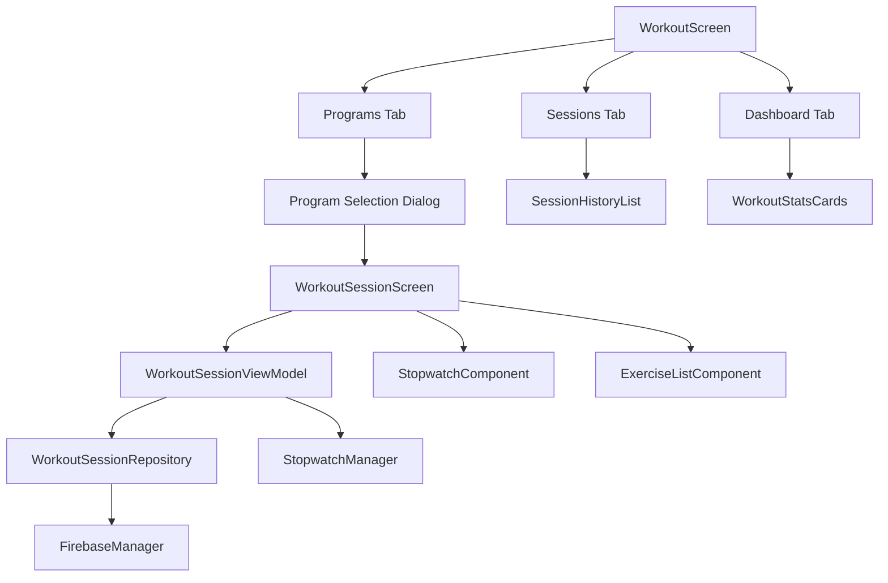

# Design Document

## Overview

This design provides a streamlined workout session tracking system with program selection, real-time stopwatch functionality, exercise completion tracking, and workout history management. The solution focuses on simplicity and usability with three main tabs: Dashboard (homepage), Programs (program management), and Sessions (workout history).

The design leverages the existing Android architecture with Jetpack Compose, Firebase for data persistence, and follows the established MVVM pattern with the existing BaseViewModel and UiState patterns.

## Architecture

### High-Level Architecture



### Component Relationships

The simplified workout session tracking system consists of these key components:

1. **Three Main Tabs**: Dashboard (homepage), Programs (program management), Sessions (workout history)
2. **Program Selection Flow**: Start Workout → Select Program → Begin Session
3. **WorkoutSessionScreen**: Stopwatch at top, exercise list below with checkable cards
4. **StopwatchManager**: Handles timer functionality with pause/resume capabilities
5. **WorkoutSessionRepository**: Manages data persistence to Firebase and local storage

## Components and Interfaces

### User Flow

1. **Dashboard Tab**: Shows workout statistics and "Start Workout" button
2. **Start Workout**: Displays program selection dialog
3. **Program Selection**: User selects a program and confirms
4. **Workout Session**: Stopwatch at top, exercise cards below (checkable)
5. **Finish Workout**: Stop button saves workout and returns to dashboard
6. **Sessions Tab**: Shows completed workout history
7. **Programs Tab**: Manage workout programs

### Core Data Models

#### WorkoutSession (Active Session)
```kotlin
data class WorkoutSession(
    val id: Long = 0,
    val programId: Long,
    val programName: String,
    val startTime: Date = Date(),
    val pausedDuration: Long = 0,
    val exercises: List<SessionExercise> = emptyList(),
    val isActive: Boolean = true
)
```

#### SessionExercise (Exercise during workout)
```kotlin
data class SessionExercise(
    val exerciseId: Long,
    val exerciseName: String,
    val muscleGroup: String? = null,
    val sets: Int,
    val reps: Int,
    val weight: Double,
    val isCompleted: Boolean = false
)
```

#### CompletedWorkout (Saved workout history)
```kotlin
data class CompletedWorkout(
    val id: Long = 0,
    val programId: Long,
    val programName: String,
    val startTime: Date,
    val endTime: Date,
    val totalDuration: Long,
    val exercises: List<CompletedExercise> = emptyList()
)
```

### StopwatchManager

```kotlin
interface StopwatchManager {
    val elapsedTime: StateFlow<Long>
    val isRunning: StateFlow<Boolean>
    val isPaused: StateFlow<Boolean>
    
    fun start()
    fun pause()
    fun resume()
    fun stop()
    fun reset()
}

class StopwatchManagerImpl : StopwatchManager {
    private val _elapsedTime = MutableStateFlow(0L)
    private val _isRunning = MutableStateFlow(false)
    private val _isPaused = MutableStateFlow(false)
    
    private var startTime: Long = 0
    private var pausedTime: Long = 0
    private var timer: Timer? = null
    
    // Implementation details...
}
```

### WorkoutSessionViewModel

```kotlin
class WorkoutSessionViewModel(
    private val repository: WorkoutSessionRepository,
    private val stopwatchManager: StopwatchManager,
    private val workoutHistoryManager: WorkoutHistoryManager
) : BaseViewModel() {
    
    private val _currentSession = MutableStateFlow<WorkoutSession?>(null)
    val currentSession: StateFlow<WorkoutSession?> = _currentSession.asStateFlow()
    
    private val _sessionUiState = MutableStateFlow<UiState<WorkoutSession>>(UiState.Loading)
    val sessionUiState: StateFlow<UiState<WorkoutSession>> = _sessionUiState.asStateFlow()
    
    val elapsedTime: StateFlow<Long> = stopwatchManager.elapsedTime
    val isStopwatchRunning: StateFlow<Boolean> = stopwatchManager.isRunning
    val isStopwatchPaused: StateFlow<Boolean> = stopwatchManager.isPaused
    
    fun startWorkoutSession(program: Program? = null)
    fun pauseWorkout()
    fun resumeWorkout()
    fun completeExerciseSet(exerciseId: Long, setNumber: Int, reps: Int, weight: Double)
    fun uncompleteExerciseSet(exerciseId: Long, setNumber: Int)
    fun finishWorkout(notes: String? = null)
    fun saveSessionState()
    fun restoreSessionState()
}
```

### WorkoutSessionRepository

```kotlin
interface WorkoutSessionRepository {
    suspend fun saveActiveSession(session: WorkoutSession)
    suspend fun getActiveSession(): WorkoutSession?
    suspend fun clearActiveSession()
    suspend fun saveCompletedWorkout(workout: Workout)
}

class WorkoutSessionRepositoryImpl(
    private val firebaseManager: FirebaseManager,
    private val cacheManager: WorkoutSessionCache
) : WorkoutSessionRepository {
    // Implementation using Firebase and local caching
}
```

### WorkoutSessionCache

```kotlin
interface WorkoutSessionCache {
    suspend fun saveSession(session: WorkoutSession)
    suspend fun getSession(): WorkoutSession?
    suspend fun clearSession()
}

class WorkoutSessionCacheImpl(
    private val context: Context
) : WorkoutSessionCache {
    // Implementation using SharedPreferences or Room for local persistence
}
```

## Data Models

### Enhanced Workout Data Model

The existing `Workout` data model will be extended to support the new session tracking features:

```kotlin
// Enhanced Workout model (extends existing)
data class Workout(
    val id: Long = 0,
    val programId: Long? = null,
    val programName: String? = null,
    val startTime: Date = Date(),
    val endTime: Date? = null,
    val duration: Long = 0, // Total duration including pauses
    val activeDuration: Long = 0, // Active workout time excluding pauses
    val exercises: List<WorkoutExercise> = emptyList(),
    val notes: String? = null,
    val completionPercentage: Float = 0f, // Percentage of exercises completed
    val totalSetsCompleted: Int = 0,
    val totalSetsPlanned: Int = 0
)
```

### Workout Statistics Model

```kotlin
data class WorkoutStats(
    val totalWorkouts: Int = 0,
    val totalDuration: Long = 0,
    val averageDuration: Long = 0,
    val weeklyWorkouts: Int = 0,
    val monthlyWorkouts: Int = 0,
    val mostFrequentExercises: List<ExerciseFrequency> = emptyList(),
    val workoutTrends: WorkoutTrends? = null
)

data class ExerciseFrequency(
    val exerciseName: String,
    val frequency: Int,
    val lastPerformed: Date
)

data class WorkoutTrends(
    val durationTrend: List<TrendPoint> = emptyList(),
    val frequencyTrend: List<TrendPoint> = emptyList()
)

data class TrendPoint(
    val date: Date,
    val value: Float
)
```

## Error Handling

### Error Types

```kotlin
sealed class WorkoutSessionError : Exception() {
    object SessionNotFound : WorkoutSessionError()
    object SessionAlreadyActive : WorkoutSessionError()
    object InvalidExerciseId : WorkoutSessionError()
    object InvalidSetNumber : WorkoutSessionError()
    data class PersistenceError(override val message: String) : WorkoutSessionError()
    data class NetworkError(override val message: String) : WorkoutSessionError()
}
```

### Error Handling Strategy

1. **Session State Errors**: Gracefully handle session restoration failures by offering to start a new session
2. **Network Errors**: Cache session data locally and sync when connection is restored
3. **Data Validation Errors**: Provide clear feedback to users about invalid inputs
4. **Persistence Errors**: Implement retry mechanisms with exponential backoff

## Testing Strategy

### Unit Tests

1. **StopwatchManager Tests**
   - Timer accuracy and state management
   - Pause/resume functionality
   - Edge cases (rapid start/stop, long durations)

2. **WorkoutSessionViewModel Tests**
   - Session lifecycle management
   - Exercise completion tracking
   - State persistence and restoration

3. **Repository Tests**
   - Data persistence and retrieval
   - Cache synchronization
   - Error handling scenarios

### Integration Tests

1. **End-to-End Workout Flow**
   - Start workout → complete exercises → finish workout → verify history
   - Session persistence across app navigation
   - Offline/online synchronization

2. **UI Tests**
   - Stopwatch display accuracy
   - Exercise completion interactions
   - Navigation between workout screens

### Performance Tests

1. **Memory Usage**: Monitor memory consumption during long workout sessions
2. **Battery Impact**: Measure battery drain from continuous timer operation
3. **Data Sync**: Test performance with large workout histories

## Implementation Phases

### Phase 1: Core Session Management
- Implement StopwatchManager
- Create WorkoutSessionViewModel
- Build basic session persistence
- Add workout session UI components

### Phase 2: Exercise Tracking
- Implement exercise completion tracking
- Add set-by-set progress monitoring
- Create exercise list UI components
- Add completion state persistence

### Phase 3: Workout History
- Implement workout history storage
- Create stats calculation logic
- Build workout history UI
- Add detailed workout view

### Phase 4: Advanced Features
- Add workout trends and analytics
- Implement session recovery mechanisms
- Add workout templates and customization
- Performance optimizations

## Security Considerations

1. **Data Privacy**: Workout data is stored locally and synced to user's Firebase account
2. **Session Security**: Active sessions are encrypted when stored locally
3. **Data Validation**: All user inputs are validated before persistence
4. **Access Control**: Workout data is scoped to the authenticated user's device ID

## Performance Considerations

1. **Timer Efficiency**: Use system timer with minimal CPU impact
2. **Memory Management**: Limit in-memory workout history to recent sessions
3. **Data Sync**: Implement intelligent sync to minimize network usage
4. **UI Responsiveness**: Use coroutines for all background operations
5. **Battery Optimization**: Optimize timer implementation for minimal battery drain